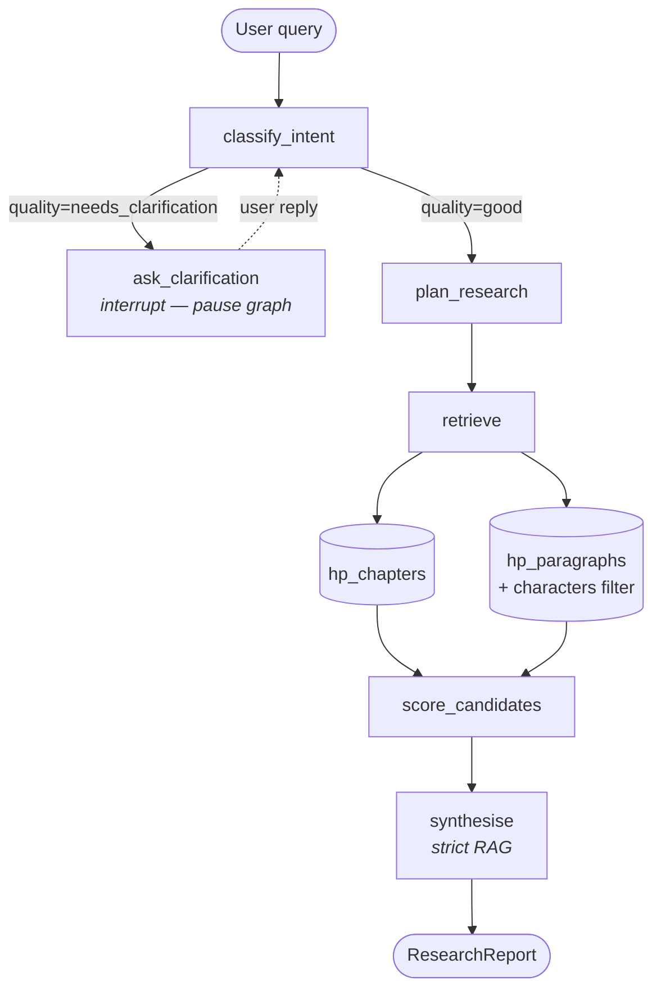
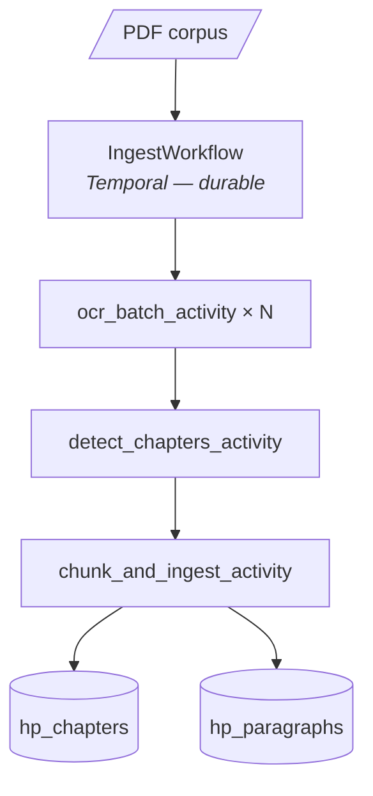

# Horcrux

> A deep research agent over a literary corpus.
> Ask the corpus a question; get back a structured, conviction-scored report
> grounded only in retrieved passages.

Weekend lab evaluating six tools side-by-side on a non-trivial RAG problem:
**PydanticAI** · **LangGraph** · **Temporal** · **Qdrant** · **LiteLLM** · **LangSmith**.

---

## Why this exists

Most RAG demos hand-wave the parts that actually matter — chunking strategy,
retrieval routing, grounding discipline, durable ingest, human-in-the-loop
clarification. This lab takes a single bounded problem (a 3600-page literary
corpus) and forces each of those concerns into its own layer, so the trade-offs
are observable rather than assumed.

The output isn't a product. It's an opinion on the toolchain — what each tool
earned, what was friction, where the boundaries land.

---

## Architecture at a glance



Ingest is a separate, durable Temporal workflow:



Full system design: [`docs/horcrux_system_design.md`](docs/horcrux_system_design.md).
Phase-by-phase walkthrough: [`docs/lab/toolchain-path.md`](docs/lab/toolchain-path.md).

---

## What each tool earned

| Tool | Role | What it delivered |
|---|---|---|
| **PydanticAI** | Typed boundary at every LLM call | Schema-as-contract; automatic validation retry on bad model output. |
| **LangGraph** | Query-pipeline orchestration | Conditional routing, parallel retrieval, human-in-the-loop interrupts. |
| **Temporal** | Durable ingest | Crash mid-OCR, restart, resume from last completed batch — proven by deliberate kill test. |
| **Qdrant** | Vector storage | Two collections at different granularities; payload-filtered ANN search. |
| **LiteLLM** | Model router | Provider-agnostic; swap models by editing one YAML line; spend tracking. |
| **LangSmith** | Observability | Full graph trace per query; visualises the conditional routing as a tree. |

---

## Running it

You will need a legally-obtained PDF of the corpus you want to research.
**Nothing copyrighted is shipped with this repo.**

### One-time setup

```bash
# 1. Python deps
uv sync

# 2. Set secrets
cp .env.example .env
# Edit .env — add ANTHROPIC_API_KEY and LANGCHAIN_API_KEY

# 3. Drop your corpus PDF into the data lake
cp /path/to/your/corpus.pdf ./data_lake/corpus.pdf

# 4. System dep
sudo apt install tesseract-ocr      # or `brew install tesseract` on macOS
```

### Three terminals

```bash
# Terminal 1 — Qdrant
make local

# Terminal 2 — Temporal dev server
scripts/temporal-dev.sh

# Terminal 3 — LiteLLM proxy
litellm --config litellm_config.yaml --port 4000
```

### Ingest (one-time, ~45 min for a 3600-page corpus)

```bash
# Start the worker
uv run python -m horcrux.worker

# Trigger ingest
uv run python -m horcrux.main ingest

# Watch progress at localhost:8233 (Temporal UI)
# Safe to kill and restart — resumes from last completed batch.
```

### Query

```bash
uv run python -m horcrux.main \
  "Trace the protagonist's loyalty arc across the series"

uv run python -m horcrux.main \
  "Which characters showed unexpected bravery and in what circumstances?"
```

Output renders as a Rich-formatted panel: summary, findings (each with a
conviction badge), gaps, and source citations. `--verbose` adds the
`QueryIntent` and per-candidate scoring breakdown.

---

## Design discipline

This lab follows the same conventions a production codebase would:

- **ADRs** — every non-trivial decision has one in [`docs/adr/`](docs/adr/), with
  context, alternatives considered, consequences, and (where relevant) rollback.
- **Change log** — daily working notes in [`docs/log/`](docs/log/), append-only.
- **Strict RAG** — answers come *only* from retrieved chunks, enforced at three
  layers: prompt, schema (`min_length=1` on `source_ids`), runtime check.
- **Typed contracts** — every LLM I/O is a Pydantic model, validated.
- **Reproducible env** — `pyproject.toml`, `Makefile`, `docker-compose`, `.env.example`.
- **Tested** — unit tests use synthetic fantasy fixtures (no copyrighted content).

---

## What's deliberately out of scope

- Web UI. The CLI *is* the product.
- Multi-tenant deployment, auth, rate limiting at the app layer.
- Production-grade Temporal cluster (we use the dev server).
- Embedding model fine-tuning.
- Cost guardrails beyond LiteLLM's soft caps.

---

## Honest scoping

A weekend, deliberately. The point is to evaluate whether these six tools
compose well on a real-shaped problem — not to ship a SaaS.

If it took longer than a weekend, the lab would be honest about that too.
That's what [`docs/log/`](docs/log/) is for.
