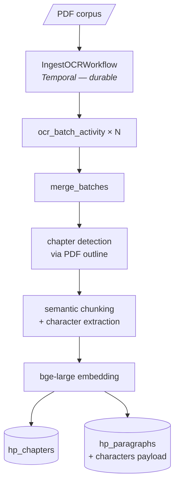
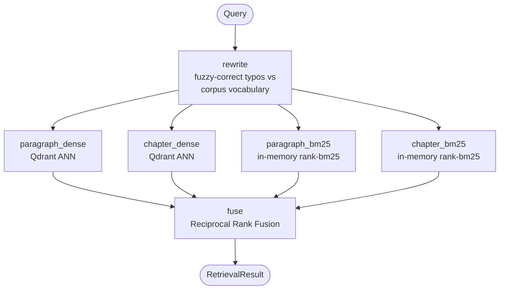
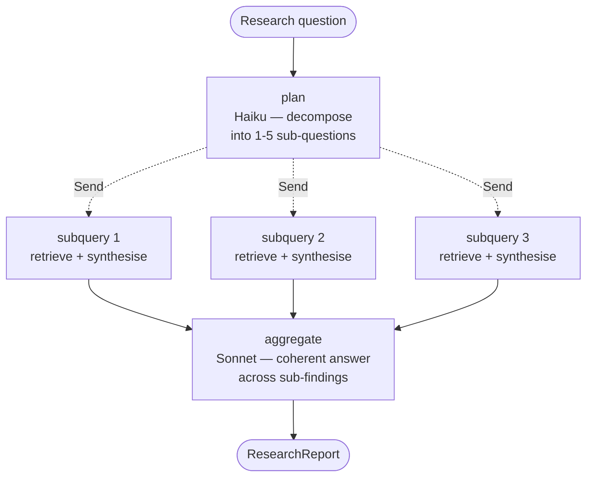

# Horcrux

> A deep-research RAG agent over a literary corpus. Ask the corpus a
> question; watch a planner decompose it into focused sub-questions, see
> sub-queries run in parallel, get back a coherent answer with conviction-
> scored citations grounded only in what the corpus actually contains.

Weekend lab evaluating six tools side-by-side on a non-trivial RAG problem:
**PydanticAI** · **LangGraph** · **Temporal** · **Qdrant** · **LiteLLM** · **LangSmith**.

Built collaboratively with AI coding agents (Claude Code) under explicit
engineering discipline — see [How it was built](#how-it-was-built).

---

## What it does

Three modes, all running against the same indexed corpus:

| Mode | Command | Use when |
|---|---|---|
| **Answer** — single-shot, fast. | `make answer Q="..."` | Focused factual questions. |
| **Chat** — multi-turn, history-aware. | `make chat` | Follow-ups that reference prior turns ("what about his motive?"). |
| **Research** — planned, parallel, with visible reasoning. | `make research Q="..."` | Multi-faceted questions whose answer spans many books. |

The research mode is the one to look at first. A demo transcript
(*"tell me about Snape's story arc"*):

```
▶ Planning…
   ↳ What is Snape's role in the early books and his relationship with Harry?
   ↳ What did Snape's memories in The Prince's Tale reveal about his past
     and his loyalty to Dumbledore?
   ↳ Why did Snape kill Dumbledore and what were his motivations?
   ↳ How did Harry's perception of Snape change after learning the truth?

▶ Sub-queries (parallel)
   ⠋ What is Snape's role in the early books…              …running
   ⠋ What did Snape's memories in The Prince's Tale…       …running
   ⠋ Why did Snape kill Dumbledore…                        …running
   ⠋ How did Harry's perception of Snape change…           …running
   ✓ Snape's role in early books          10 hits, 7 cited, conviction 5/5, 29.0s
   ✓ Why Snape killed Dumbledore           10 hits, 4 cited, conviction 4/5, 30.1s
   ✓ Memories in The Prince's Tale         10 hits, 5 cited, conviction 3/5, 31.8s
   ✓ Harry's perception change             10 hits, 5 cited, conviction 3/5, 36.1s

▶ Synthesising final report…

  Severus Snape's story arc spans all seven Harry Potter novels, moving
  from apparent villainy to a posthumous revelation of hidden heroism…
  [coherent multi-paragraph answer drawing on all four sub-findings]

  conviction: 4/5 (high)  citations: 19  gaps: 3
```

19 citations spanning all 7 books. Final conviction is **4/5, not 5/5** —
bounded by the weakest sub-finding, exactly the calibration pattern good
research agents need. Three honest gaps surfaced (the parts the corpus
didn't cover), not papered over with parametric guesses.

The same question via single-shot returns a shallower answer with 9
citations and misses the Lily-love and planned-killing reveals. Multi-step
planning isn't ceremony — it's the only way to get arc-shaped questions
right without throwing the whole corpus into a million-token context.

---

## Why this lab exists

Most RAG demos hand-wave the parts that actually matter — chunking
strategy, retrieval routing, grounding discipline, durable ingest,
multi-step planning, conversational memory, calibration. This lab takes
one bounded problem (a 3,600-page literary corpus, OCR'd from a personal
PDF) and forces each of those concerns into its own observable layer.

The output isn't a product. It's an opinion on the toolchain — what
each tool earned, what was friction, where the boundaries land, and which
production patterns *generalise* vs which only worked because the corpus
was famous.

What makes it genuinely interesting as a portfolio artefact:

- **It works.** All six tools wired up; three CLI surfaces; 203 unit
  tests passing; ~22 documented findings; 9 ADRs.
- **The agent's reasoning is visible.** Research mode streams every
  step (plan, parallel sub-queries, fusion, synthesis) so you can see
  the system *think*. That's the demo — opacity reads as magic at
  best, broken at worst.
- **It surfaces its own failure modes.** [`docs/lab/findings.md`](docs/lab/findings.md)
  catalogues 22+ empirical findings, including the ones where my
  hypotheses were wrong. The catalog is a portfolio in itself.
- **Honest about what it isn't.** [ADR-0008](docs/adr/pending/ADR-0008-qdrant-for-the-lab-opensearch-for-production.md)
  explicitly says "Qdrant for the lab, OpenSearch for production
  where OS is already in the stack." Not a sales pitch.

---

## Architecture

Three graphs and one durable workflow, composing into one system.

### Ingest pipeline (Temporal-driven, durable)



OCR earned Temporal because the failure profile demanded it: 30+ minutes
of slow IO-bound work, partial-progress recovery matters, kill-and-resume
behaviour is testable end-to-end. Embedding doesn't earn Temporal
(deterministic + idempotent + single-process); ran raw.

### Retrieval graph (LangGraph, 4-way modality + granularity hybrid)



Two axes of hybridity: **granularity** (chapter + paragraph chunks) and
**modality** (dense semantic + sparse keyword). Catches both paraphrase
matches *and* rare-keyword matches. Discovered the modality gap when a
real query ("name the conjunctivitis spell") returned nothing under
dense-only retrieval — a rare keyword the embedder compressed away.
See [Finding 21](docs/lab/findings.md) (`Ctrl+F` for "Finding 21").

### Research graph (LangGraph with `Send` fan-out)



`Send`-based fan-out so each sub-query is its own node event in
`graph.astream` — that's what gives research mode its visible-reasoning
UX. Strict-RAG enforces at every synthesis layer (sub-syntheses + the
aggregator); planner is parametric by design, with the limits called
out explicitly in [ADR-0009](docs/adr/pending/ADR-0009-research-mode-planner-aggregator.md).

### Strict-RAG enforcement

Three layers per LLM call, every call:

1. **System prompt** forbids parametric knowledge.
2. **Schema** — `Finding.source_ids` has `min_length=1`. Pydantic
   validation error → PydanticAI auto-retry.
3. **Runtime check** — every cited passage number must be in
   `[1..N]`. Out-of-range → `ValueError`. Caught a real failure live:
   Sonnet dropped two characters from a UUID; the runtime check rejected
   the fabricated citation; the next session switched to numbered
   citations to remove the failure mode at its root.

Full system design: [`docs/horcrux_system_design.md`](docs/horcrux_system_design.md).
Phase walkthrough: [`docs/lab/toolchain-path.md`](docs/lab/toolchain-path.md).
Architecture decisions: [`docs/adr/`](docs/adr/).

---

## How it was built

This lab was built collaboratively with AI coding agents (Claude Code,
Opus 4.7) over a series of focused sessions. **The agents didn't replace
engineering rigor — the rigor is what made the agent collaboration
productive.** This section is honest about what that actually looked
like, because most write-ups of AI-built software either pretend the
human wasn't involved or pretend the AI wasn't.

### The dev cycle, concretely

Each phase of the lab followed the same rhythm:

```
1. Brainstorm out loud           → human + agent agree on shape
2. ADR if non-trivial             → docs/adr/pending/ADR-XXXX.md
3. Tests-first where it adds signal  → unit tests for pure functions
4. Skeleton with stubs            → wire the topology, no real LLMs yet
5. Live verification              → run end-to-end, eyeball output
6. Replace stubs with real logic  → agents, retrievers, etc.
7. Findings if surprises          → docs/lab/findings.md, append
8. Commit + push                  → one coherent step per commit
```

Most phases took 2–6 hours. The skeleton-first step was load-bearing:
research mode shipped with a stub planner and stub aggregator first,
which let the streaming UX be debugged in isolation before the real
Haiku/Sonnet agents replaced the stubs. Every layer is independently
debuggable because every layer was built that way deliberately.

### Where the agent helped most

- **Mechanical refactors** — the subpackage reorganisation (49 files
  moved with `git mv` to preserve blame, ~50 imports rewritten,
  circular-import bug caught and fixed) took ~30 minutes with the
  agent driving the rote work. Unit tests confirmed zero regression.
- **Boilerplate-heavy modules** — Pydantic models, LangGraph state
  machines, Rich rendering loops. The patterns are stable; agents
  fill them in correctly given clear specs.
- **End-to-end smoke verification** — running queries, parsing live
  output, surfacing the specific failure modes that motivated the
  next round of changes (the conjunctivitis-curse case → BM25;
  the UUID transcription bug → numbered citations; the rate-limit
  case → chapter-chunk truncation). The agent ran the experiment;
  the human read the result.
- **Doc discipline** — once one ADR was written in the standard
  shape, every subsequent ADR matched it. Same for findings — the
  Symptom/Root cause/Fix/Lesson template held across all 22+ entries
  without prompting.

### Where the human still drove

- **Architectural calls.** The agent surfaced alternatives well; the
  human made the trade-off. Example: when adding BM25, the agent
  proposed Qdrant native sparse vectors (the textbook fix). The human
  said "the corpus is 17MB — an in-memory `rank-bm25` index is the
  right call at this scale." The human was correct, and ADR-0008's
  alternatives section now documents both paths.
- **Catching parametric leakage.** The observation that the planner
  was leveraging Sonnet's training-time knowledge of HP to name
  specific chapter titles ("The Prince's Tale") in its sub-questions
  came from the human reading live output. The agent would have
  shipped without flagging it. Documented as a known-good limitation
  in ADR-0009.
- **Calibration judgement.** The agent biased toward `conviction=5/5`.
  The human looked at the actual evidence chain and pushed for
  honest calibration. Finding 20 documents the drift; the planner-
  aggregator architecture organically resolved it (each sub-finding
  carries its own conviction; the aggregator is bounded by the
  weakest, exactly the calibration pattern that was missing in
  single-shot mode).
- **Deciding when to stop.** "This is complete; the next step is
  weeks of optimisation" is a scope call, not a technical one. The
  lab's discipline includes knowing when not to keep building.

### How the AI got things wrong

Worth saying plainly. Examples directly from the findings catalog:

- **Sonnet dropped two characters from a UUID** when transcribing it
  into a citation. The runtime check (Layer 3 of strict-RAG) caught
  the fabrication; the next session redesigned citations to use
  passage *numbers* so the failure mode couldn't recur. Documented in
  the [numbered-citations commit](https://github.com/heyashy/horcrux/commit/62fd676).
- **Three parallel sub-queries each loaded their own copy of the
  bge-large model** and OOM'd the GPU. Race condition in the lazy
  loader; fixed with double-checked locking. Caught the first time
  research mode ran end-to-end.
- **Chapter chunks blew the rate limit** — they store full chapter
  text (3-5k tokens), and a top-10 candidate set with two chapter
  hits ran straight past Anthropic's 30k-tokens-per-minute cap. Fixed
  by truncating chapter chunks to a 200-word head in the synthesis
  prompt; surface benefit was cleaner citations because the model
  could no longer mistake chapter chunks for fine-grained evidence.

In each case, the loop that fixed it was the same: run the system,
read the output, identify the root cause, write the fix, verify the
specific failing case now passes. **The agents accelerated each step;
the measurement loop kept the work correct.**

### What this lab demonstrates about AI-augmented engineering

Three claims, in order of importance:

1. **Discipline scales human-AI collaboration.** TDD on pure
   functions, ADRs for non-trivial decisions, typed contracts at
   every LLM boundary, and a findings catalog that records empirical
   reality — these are what gave the agents a structure to work
   within. Strip those out and AI output is unverified and
   non-composable. Keep them, and a long weekend ships a system that
   would otherwise take weeks.

2. **Layered verification beats end-to-end faith.** When something
   broke, we didn't ask the model to "try harder." We identified the
   layer at fault (retrieval missing rare keywords → add BM25;
   citation transcription failing → numbered citations; conviction
   anchoring high → add planner+aggregator), built the fix at that
   layer, and verified the specific failure case now passed. Agents
   excel at executing the fix; humans pick where to fix.

3. **The findings catalog is the lab's most valuable artefact.**
   Anyone can clone an AI-built RAG and demo a happy path. Few have
   22 documented failure modes, with root causes and lessons,
   collected from running the system and watching it produce wrong
   answers. That document is the portfolio piece.

---

## Engineering discipline

Repo conventions:

- **`docs/adr/pending/`** — 9 ADRs. Each has context / decision /
  alternatives / consequences / rollback. ADRs move to `done/` when
  the change ships.
- **`docs/lab/findings.md`** — 22+ findings. Each has Symptom / Root
  cause / Fix / Lesson. Includes a meta-section grouping them by how
  they were caught (real-output inspection vs architectural
  reflection vs hard-limit hits).
- **`docs/log/`** — append-only daily change log. Records what
  shipped each day, what ADRs progressed, what tests landed.
- **`docs/horcrux_system_design.md`** — the full system design as a
  single readable doc.
- **`docs/lab/toolchain-path.md`** — phase-by-phase walkthrough,
  framed as a learning path.
- **`docs/lab/character-discovery-deep-dive.md`** — review-style
  walkthrough of the three-tier character discovery system.

Code conventions:

- **Strict RAG enforced at three layers** (prompt + schema + runtime).
- **Typed contracts everywhere** — every LLM I/O is a Pydantic model;
  validation retry is automatic via PydanticAI.
- **Centralised config** — `pydantic-settings` singleton in
  `horcrux/config.py`. No `os.getenv` in core logic. Fail-fast
  validation at import time.
- **Subpackage layout** by concern — `corpus/`, `retrieval/`,
  `agents/`, `research/`, `chat/`. You can read the architecture
  from `ls horcrux/`.
- **Reproducible env** — `pyproject.toml`, `Makefile`,
  `docker-compose`, `.env.example`. `make preflight` checks every
  external dependency in one go.
- **203 unit tests + integration + smoke**. Lint-clean per
  per-file-ignores documented in `pyproject.toml`.

---

## What each tool earned

| Tool | Role | Why it stayed | Fine print |
|---|---|---|---|
| **PydanticAI** | Typed boundary at every LLM call | Schema-as-contract; auto-retry on validation failure; `result_type` makes hallucinated structure impossible. | — |
| **LangGraph** | Orchestration for retrieval + research graphs | Conditional edges, parallel fan-out via `Send`, native streaming via `astream`. The streaming-debug events are what make research mode's visible reasoning work. | First place that actually earned `Send` over `asyncio.gather`: when each branch needs to be independently visible in stream events. |
| **Temporal** | Durable ingest workflow | Crash mid-OCR, restart, resume from last completed batch — proven by deliberate kill test on a 22-min run. | Dev-server only (in-memory, single-binary). Production cluster is out of scope. |
| **Qdrant** | Vector storage | Two collections × payload-filtered ANN. Clean API for the lab's volume. | For production with existing OpenSearch, **use OpenSearch hybrid search instead** — see [ADR-0008](docs/adr/pending/ADR-0008-qdrant-for-the-lab-opensearch-for-production.md). The lab uses Qdrant deliberately because the lab evaluates Qdrant. |
| **LiteLLM** | Model router (proxy at `localhost:4000`) | One-line model swap via YAML; provider-agnostic; spend tracking; in-memory response cache during dev. | — |
| **LangSmith** | Observability | Full graph trace per query; visualises conditional routing as a tree. Auto-instrumented via two env vars. | Optional — set `LANGCHAIN_API_KEY=` to enable. |

Three additional libraries earn quiet credit:

- **`bge-large-en-v1.5`** for dense embeddings (Qdrant gRPC + cosine).
- **`rank-bm25`** for the in-memory sparse index. ~6ms queries on
  5,500 chunks; chosen over Qdrant native sparse for lab-scale
  pragmatism (see ADR-0008's BM25 alternative section).
- **`fastcoref`** + spaCy NER for character-discovery Tier 1.

---

## Running it

You will need a legally-obtained PDF of the corpus you want to research.
**Nothing copyrighted is shipped with this repo.**

### Prerequisites

| Tool | Why | Install |
|---|---|---|
| **`uv`** | Python package manager. | <https://docs.astral.sh/uv/> |
| **`docker`** | Runs the Qdrant container. | <https://docs.docker.com/engine/install/> |
| **`tesseract`** | OCR engine for the ingest pipeline. | `apt install tesseract-ocr` (Ubuntu) · `brew install tesseract` (macOS) |
| **`temporal`** | Bundled dev server (frontend + history + matching + visibility, all in one binary). | `curl -sSf https://temporal.download/cli.sh \| sh` — then add `~/.temporalio/bin` to PATH |
| **`litellm[proxy]`** | Model-routing proxy. Installed by `uv sync`. | covered by `uv sync` |

```bash
make preflight     # six green ticks confirms everything's wired
```

### One-time setup

```bash
uv sync                                          # python deps
cp .env.example .env                             # then add ANTHROPIC_API_KEY, LITELLM_MASTER_KEY
cp /path/to/corpus.pdf data_lake/corpus.pdf      # your legally-obtained PDF
make test                                         # 203 unit tests should pass
```

### Three terminals

```bash
# Terminal 1 — Qdrant
make local

# Terminal 2 — LiteLLM proxy
make proxy

# Terminal 3 — Temporal dev server (only if running ingest)
make temporal
```

### Ingest (one-time, ~45 min for a 3600-page corpus)

```bash
make worker        # in another terminal, start the worker
make ingest        # trigger the workflow
                   # safe to kill and restart; resumes from last completed batch.
                   # watch progress at localhost:8233 (Temporal UI)
```

Then build the gold-tier artefacts:

```bash
make chapters      # raw_pages.json → chapters.json
make chunks        # chapters + alias-dict → chunks.json
make embed         # chunks.json → Qdrant
```

### Query

```bash
make answer Q="who killed Cedric Diggory"           # single-shot
make chat                                            # multi-turn with history
make research Q="tell me about Snape's story arc"   # multi-step with visible reasoning
make search Q="..."                                  # retrieval only (no synthesis)
```

The `chat` REPL has slash commands: `/research`, `/trace` (re-render
last research run), `/history`, `/clear`, `/help`.

---

## Repository layout

```
horcrux/                      # the package — concern-grouped subpackages
├── config.py                 # pydantic-settings singleton
├── models.py                 # Pydantic types — single source of truth
├── main.py / worker.py       # entry points
├── corpus/                   # PDF → chunks ready to embed
├── retrieval/                # finding relevant chunks (4-way hybrid)
├── agents/                   # LLM-driven synthesis (single-shot, planner, aggregator)
├── research/                 # multi-step research mode with streaming UX
├── chat/                     # multi-turn conversation primitives
└── pipelines/ocr/            # Temporal workflow for OCR

scripts/                      # CLI entry points (answer / chat / research / search / build_*)
tests/{unit,integration,smoke}/   # 203 unit tests; integration + smoke against live infra
docs/
├── adr/{pending,done}/       # 9 ADRs
├── lab/                      # findings.md, toolchain-path.md, deep-dives
└── log/                      # append-only daily change log
data_lake/                    # gitignored — corpus PDF lives here
data/                         # processed artefacts (chapters / chunks / aliases) — gitignored
```

---

## What's deliberately out of scope

- **Web UI** — the CLI is the product.
- **Production deployment** — no Terraform / CI / cloud. Local-only lab.
- **Multi-tenant auth, rate limiting at the app layer** — out of frame.
- **Embedding model fine-tuning** — bge-large off-the-shelf.
- **Long-context single-shot mode** — the lab's whole point is that
  you can do better than throwing 1M tokens at a model. See ADR-0009.
- **SQLite checkpointer for clarification interrupts** — designed in
  ADR-0003 but not built; queued as the next phase if the lab
  resumes.
- **Grounded planner** (planner reads retrieved snippets before
  decomposing) — would extend the lab to private corpora where the
  planner can't lean on training knowledge. Discussed in ADR-0009.
- **Query optimisation, context optimisation, planner optimisations**
  — each is weeks of work; deferred.

---

## Honest scoping

A long weekend, deliberately. The point was to evaluate whether these
six tools compose well on a real-shaped problem — not to ship a SaaS.

If something took longer than planned, the lab is honest about it —
that's what [`docs/log/`](docs/log/) and [`docs/lab/findings.md`](docs/lab/findings.md)
record. Most of the value here isn't in the artefact's polish; it's
in the documentation of the *path*.

The current state:

- **Phases shipped:** OCR ingest, chapter detection, character
  discovery (3-tier), semantic chunking, dense embedding, hybrid
  retrieval (granularity + modality), single-shot synthesis,
  conversational chat, multi-step research with streamed reasoning.
- **9 ADRs** documenting non-trivial decisions.
- **22+ findings** documenting empirical lessons from real runs.
- **203 unit tests** + integration + smoke.
- **21 commits** over the lab's life, each one a coherent step.

The next reasonable additions (clarification interrupts, grounded
planning, query rewriting via LLM, learned re-ranking, contextual
chunking) are each their own multi-week project. Stopping here is the
disciplined call.

---

## Reading the lab

If you have an hour:

1. **Watch a research run** — clone, set up, `make research Q="..."`. See the streaming UX in action.
2. **Read [`docs/horcrux_system_design.md`](docs/horcrux_system_design.md)** — the full architectural picture in one document.
3. **Skim [`docs/lab/findings.md`](docs/lab/findings.md)** — 22+ failure modes documented. The Snape arc, the conjunctivitis curse, the UUID transcription bug — all have entries.
4. **Pick one ADR** — [ADR-0001](docs/adr/pending/ADR-0001-dual-orchestrator-architecture.md) (Temporal vs LangGraph), [ADR-0008](docs/adr/pending/ADR-0008-qdrant-for-the-lab-opensearch-for-production.md) (Qdrant vs OpenSearch), or [ADR-0009](docs/adr/pending/ADR-0009-research-mode-planner-aggregator.md) (research-mode design) — to see how decisions were structured.
5. **Read [`docs/log/`](docs/log/)** chronologically — three days of building, including the dead-ends.

If you have ten minutes: just run `make research Q="tell me about Snape's story arc"` and watch the agent reason. That's the demo.
