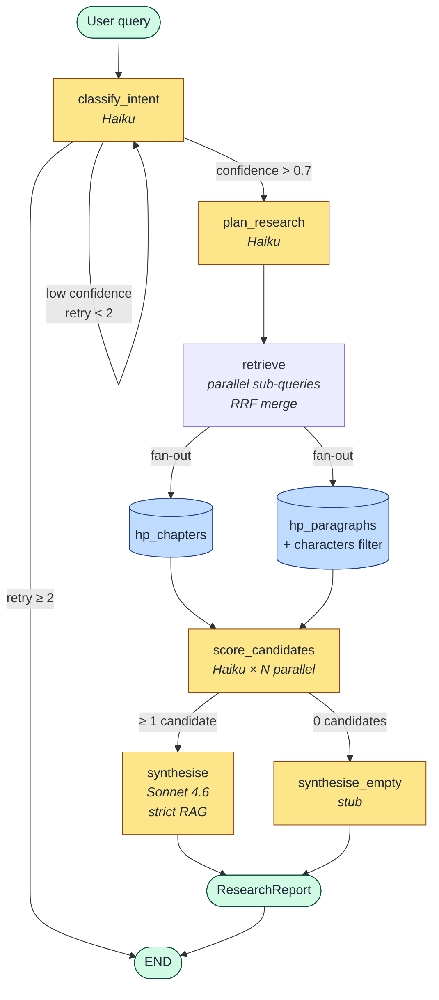
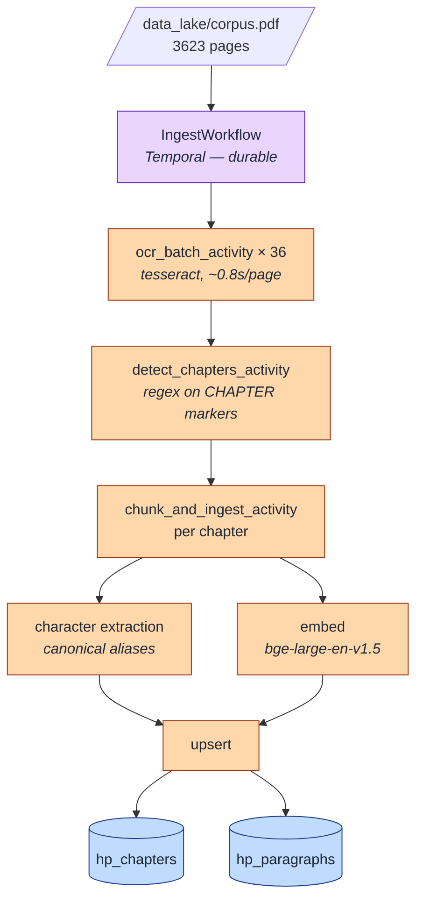

# Horcrux — System Design

> A deep research agent over a literary corpus.
> Weekend lab evaluating PydanticAI + LangGraph + Temporal + Qdrant on a non-trivial RAG problem.
> Ask the corpus anything. Get a conviction-scored, structured answer back.

---

## What it does

```
Input:  "Trace Snape's loyalty across all seven books"
Output: ResearchReport
          summary: "Snape's loyalty to Dumbledore was absolute..."
          key_findings: [
            { claim: "Snape's Unbreakable Vow...", confidence: 0.91, books: [6] },
            { claim: "Snape protected Harry repeatedly...", confidence: 0.87, books: [1,2,3] },
          ]
          conviction: 4/5
          character_insights: { "Snape": "Motivated by love not duty" }
          gaps: ["Limited coverage of Snape's early life before Hogwarts"]
```

---

## Architecture overview

```
User query
    │
    ▼
┌─────────────────────────────────────────────────────┐
│  LangGraph Pipeline                                  │
│                                                      │
│  classify_intent → plan_research → retrieve          │
│       │                               │              │
│  [retry loop]                  [parallel fan-out     │
│                                 per sub-question]    │
│                                       │              │
│                               score_candidates       │
│                               [Haiku ×2 parallel]    │
│                                       │              │
│                                  synthesise          │
│                               [Sonnet, typed output] │
└─────────────────────────────────────────────────────┘
    │
    ▼
ResearchReport (typed, validated by PydanticAI)

─────────────────────────────────────────────────────────

Ingest pipeline (one-time, ~48 minutes):

PDF (3623 pages, image-based)
    │
    ▼
┌─────────────────────────────────────────────────────┐
│  Temporal Workflow: IngestWorkflow                   │
│                                                      │
│  ocr_batch_activity (×36 batches of 100 pages)       │
│    → tesseract OCR, 2x zoom, ~0.8s/page              │
│    → crash at batch 20 → resumes from batch 20       │
│                                                      │
│  detect_chapters_activity                            │
│    → regex on "CHAPTER ONE/TWO/..." pattern          │
│    → book boundary detection from title markers      │
│    → outputs typed Chapter objects                   │
│                                                      │
│  chunk_and_ingest_activity (×per chapter)            │
│    → three chunking strategies per chapter           │
│    → bge-large-en-v1.5 embeddings                    │
│    → upsert to three Qdrant collections              │
└─────────────────────────────────────────────────────┘
```

---

## Pipeline visualisation

The ASCII diagrams above describe the topology in plain text. The Mermaid diagrams below render in GitHub / any markdown viewer. Once the code exists, `graph.get_graph().draw_mermaid_png()` will export the real, runtime-validated graph.

### Query pipeline



### Ingest pipeline



### What you'll see in LangSmith at runtime

LangSmith doesn't render the graph; it renders **runs**. For a single query:

```
horcrux  • run_id: a8f2…  • 1.84s  • 12,340 tokens

├─ classify_intent          0.31s    Haiku        QueryIntent ✓
├─ plan_research            0.42s    Haiku        ResearchPlan(3 sub-questions) ✓
├─ retrieve                 0.18s
│  ├─ qdrant.search hp_paragraphs (sub-q 1)   24 hits
│  ├─ qdrant.search hp_paragraphs (sub-q 2)   24 hits
│  └─ qdrant.search hp_paragraphs (sub-q 3)   24 hits
├─ score_candidates         0.46s    Haiku ×40   38 relevant, 22 quality
└─ synthesise               0.47s    Sonnet 4.6   ResearchReport (conviction=4) ✓
```

Each row is clickable — you see the prompt sent, the response back, tokens and latency. This is the view you'll use to answer "why did the graph route there?" or "why did synthesis return conviction=2 instead of 4?".

---

## Technology stack

| Layer | Tool | Why |
|---|---|---|
| Typed agent outputs | PydanticAI | Every agent returns a validated Pydantic model. Schema enforced via tool-call mechanism. Validation retry automatic. |
| Pipeline orchestration | LangGraph | Explicit state graph — nodes, edges, shared TypedDict state. Conditional routing. Parallel retrieval. Checkpointing. |
| Durable ingest | Temporal | 48-minute OCR job must survive crashes. Completed batches never re-run. Resume from failure point. |
| Vector storage | Qdrant | Three collections, payload-filtered ANN search. HNSW index. Self-hosted Docker. |
| Embeddings | bge-large-en-v1.5 | Open source, self-hosted on RTX 3080. 1024-dim. Asymmetric — query prefix required. |
| Small model | claude-haiku-4-5-20251001 | Intent classification, query planning, candidate scoring. Fast, cheap. |
| Large model | claude-sonnet-4-6 | Final synthesis only. Sees clean scored context. Typed ResearchReport output. |
| API | Anthropic API direct | No Bedrock, no AWS credentials. `ANTHROPIC_API_KEY` env var only. |

---

## Project structure

```
horcrux/
├── pyproject.toml
├── .env                          # ANTHROPIC_API_KEY
├── data_lake/                    # raw inputs (gitignored except README)
│   ├── README.md
│   └── corpus.pdf                # your legally-obtained PDF
├── scripts/
│   ├── test_pdf.py               # verify OCR extraction
│   ├── test_chapter_regex.py     # verify chapter detection
│   └── test_search.py            # verify Qdrant queries
└── horcrux/
    ├── __init__.py
    ├── config.py                 # pydantic-settings singleton — single source of truth for config
    ├── models.py                 # all Pydantic models
    ├── ocr.py                    # PDF extraction
    ├── chapters.py               # chapter detection
    ├── chunking.py               # semantic chunking
    ├── characters.py             # character extraction (canonical names + aliases)
    ├── ingest.py                 # Qdrant setup + upsert
    ├── retrieval.py              # search + RRF merge
    ├── agents.py                 # PydanticAI agents
    ├── graph.py                  # LangGraph pipeline
    ├── workflows.py              # Temporal workflows
    ├── activities.py             # Temporal activities
    ├── worker.py                 # Temporal worker entrypoint
    └── main.py                   # CLI entry point
```

---

## Data models

All typed. Define these first — everything else follows:

```python
# ── ingest ────────────────────────────────────────────────────

class RawPage(BaseModel):
    page_num: int
    text: str
    book_num: int | None = None

class Chapter(BaseModel):
    book_num: int
    chapter_num: int
    chapter_title: str
    text: str
    page_start: int
    page_end: int

class ChapterChunk(BaseModel):
    id: str                        # uuid4
    book_num: int
    chapter_num: int
    chapter_title: str
    text: str
    chunk_type: Literal["chapter", "paragraph"]
    characters: list[str] = []     # canonical names found in this chunk — filterable at query time
    page_start: int

# ── query pipeline ────────────────────────────────────────────

class QueryIntent(BaseModel):
    intent_type: Literal["factual", "relational", "analytical"]
    entities: list[str]            # character names from query
    confidence: float
    time_scope: Literal["single_book", "multi_book", "whole_series"]

class SubQuestion(BaseModel):
    question: str
    search_query: str              # short, dense — vector optimised
    collections: list[str]        # which Qdrant collections to search
    priority: int                  # 1-3

class ResearchPlan(BaseModel):
    sub_questions: list[SubQuestion]
    primary_characters: list[str]  # drives entity mention filtering

class CandidateScore(BaseModel):
    chunk_id: str
    relevant: bool
    quality: bool
    reason: str                    # one sentence — forces model to commit
    score: float

class Finding(BaseModel):
    claim: str
    confidence: float
    book_references: list[int]
    source_ids: list[str] = Field(min_length=1)   # strict RAG — every claim must cite retrieved chunks

class ResearchReport(BaseModel):
    query: str
    summary: str
    key_findings: list[Finding]
    conviction: int = Field(
        description=(
            "Integer 1-5. Apply the conviction rubric from the system prompt strictly. "
            "When unsure between two adjacent values, pick the lower."
        )
    )
    character_insights: dict[str, str]
    gaps: list[str]
    sources: list[str]
```

---

## Config singleton

Single source of truth for every environment variable, secret, and tunable in the app. Defined once in `horcrux/config.py` via `pydantic-settings`. Imported as `settings` everywhere else. No `os.getenv` calls in core logic — that's a CLAUDE.md rule, and this pattern enforces it structurally.

**Why a singleton, not scattered config:**
- Fails fast at startup. Missing `ANTHROPIC_API_KEY`? `Settings()` raises `ValidationError` on first import, not at the moment of the first LLM call ten minutes into ingest.
- Typed access. `settings.qdrant.port` is a checked `int`, not `int(os.getenv("QDRANT_PORT", "6333"))`.
- Secrets stay wrapped. `SecretStr` prevents accidental log leaks (`repr` shows `'**********'`).
- One file to change when adding a new external service. No grep-and-pray across the codebase.

**Shape:**

```python
# horcrux/config.py
from pydantic import Field, SecretStr
from pydantic_settings import BaseSettings, SettingsConfigDict


class QdrantConfig(BaseSettings):
    host: str = "localhost"
    port: int = 6333
    paragraphs_collection: str = "hp_paragraphs"
    chapters_collection: str = "hp_chapters"


class TemporalConfig(BaseSettings):
    address: str = "localhost:7233"
    namespace: str = "default"
    task_queue: str = "horcrux-ingest"


class LiteLLMConfig(BaseSettings):
    base_url: str = "http://localhost:4000"
    haiku_alias: str = "haiku"
    sonnet_alias: str = "sonnet"


class LangSmithConfig(BaseSettings):
    api_key: SecretStr | None = None
    project: str = "horcrux"
    tracing_enabled: bool = True


class EmbeddingConfig(BaseSettings):
    model_name: str = "BAAI/bge-large-en-v1.5"
    query_prefix: str = "Represent this sentence for searching relevant passages: "
    dim: int = 1024


class Settings(BaseSettings):
    model_config = SettingsConfigDict(
        env_file=".env",
        env_nested_delimiter="__",     # QDRANT__PORT=6333 → settings.qdrant.port
        case_sensitive=False,
        extra="ignore",
    )

    anthropic_api_key: SecretStr           # required — fails fast if missing
    corpus_path: str = "data_lake/corpus.pdf"
    checkpointer_db: str = "horcrux.db"

    qdrant: QdrantConfig = Field(default_factory=QdrantConfig)
    temporal: TemporalConfig = Field(default_factory=TemporalConfig)
    litellm: LiteLLMConfig = Field(default_factory=LiteLLMConfig)
    langsmith: LangSmithConfig = Field(default_factory=LangSmithConfig)
    embedding: EmbeddingConfig = Field(default_factory=EmbeddingConfig)


# THE singleton — assembled once at import time
settings = Settings()
```

**Usage everywhere:**

```python
from horcrux.config import settings

# agents
intent_agent = Agent(settings.litellm.haiku_alias, result_type=QueryIntent)

# qdrant
client = QdrantClient(host=settings.qdrant.host, port=settings.qdrant.port)

# temporal
client = await Client.connect(settings.temporal.address, namespace=settings.temporal.namespace)

# embedding
model = SentenceTransformer(settings.embedding.model_name)
```

**Two parallel readers of `.env`** — worth being explicit about:

1. **Python code** reads via `settings`.
2. **LiteLLM proxy** reads via its YAML's `os.environ/ANTHROPIC_API_KEY` syntax when it boots.

Both pull from the same `.env`. They don't chain — they're parallel readers of one source of truth.

**Test override pattern:**

```python
# tests/conftest.py
import pytest
from horcrux import config

@pytest.fixture(autouse=True)
def isolated_settings(monkeypatch, tmp_path):
    monkeypatch.setattr(config, "settings", config.Settings(
        anthropic_api_key="test-key",
        checkpointer_db=str(tmp_path / "test.db"),
    ))
```

`Settings.model_copy(update=...)` is the alternative when you only need to override one field.

---

## Grounding policy — strict RAG

Answers come **only** from retrieved chunks. The synthesis agent is not allowed to draw on Claude's training knowledge of Harry Potter. If retrieval misses, the answer degrades — that is a signal, not a bug, and it is how we learn the pipeline is working.

**Why:** without this rule we can't distinguish "the retriever worked" from "the LLM already knew the answer." Every chunking, routing, and scoring decision needs to be measurable in the output. Model bleed destroys the feedback loop.

**Three layers of enforcement:**

1. **Prompt** — the synthesis agent's system prompt states the policy explicitly: *answer only from the passages provided; if passages don't support a claim, do not make it; add missing topics to `gaps`; do not use general knowledge.*
2. **Schema** — `Finding.source_ids` has `min_length=1`. A claim without sources fails Pydantic validation and PydanticAI retries with the error fed back to the model.
3. **Runtime check** — after synthesis, every `source_id` in every `Finding` is verified to exist in the `scored_candidates` passed to the agent. A hallucinated ID is logged and the finding rejected.

**Graceful degradation:** if retrieval returns zero scored candidates, LangGraph routes to a `synthesise_empty` node that produces a `ResearchReport` with `conviction: 1`, empty `key_findings`, and a populated `gaps` list. Not an error — a legitimate answer.

---

## Conviction rubric

Baked into the synthesis agent's system prompt verbatim. Without it, the model bunches at 3-4 (central-tendency bias).

```
Conviction scale (1-5). Pick the single best match:
  1 — Single source; ambiguous or contradicted by other evidence.
  2 — Single source; clear but not corroborated elsewhere.
  3 — Multiple sources within a single book; all aligned.
  4 — Multiple sources across two or more books; all aligned.
  5 — Overwhelming support across the series; no contradictions found.

If any finding directly contradicts another, cap conviction at 3
regardless of source count — note the contradiction in `gaps`.
```

The `ResearchReport.conviction` field description also instructs the model: *when unsure between two adjacent values, pick the lower.* This counters the remaining upward bias at essentially zero cost.

---

## Qdrant collections

Two collections. Same embedding model. Different chunking granularity. Relational queries are served by the paragraph collection via a `characters` payload filter — no dedicated entity-mention collection.

```
hp_chapters          book_num, chapter_num, chapter_title, characters[]
                     one point per chapter (~3000-5000 tokens)
                     best for: analytical, theme queries

hp_paragraphs        book_num, chapter_num, chapter_title, characters[]
                     semantic chunks ~150-300 tokens
                     sliding window similarity, threshold 0.35
                     best for: factual, specific scene, and relational queries
```

**Query routing by intent:**

```python
QUERY_TO_COLLECTIONS = {
    "factual":    ["hp_paragraphs"],
    "relational": ["hp_paragraphs"],   # + characters[] filter applied at query time
    "analytical": ["hp_chapters", "hp_paragraphs"],
}
```

Only analytical queries fan out across collections, so RRF still gets exercised. Relational queries apply a `characters` array-keyword filter (`must contain all of <entities from QueryIntent>`) to narrow the paragraph search.

**Payload indexes** — required for filter performance:

```
book_num      INTEGER
chapter_num   INTEGER
characters    KEYWORD   # array of canonical character names — filterable with `match any` / `match all`
chunk_type    KEYWORD
```

---

## Chunking strategies

Two strategies, each answering different query shapes. Character extraction happens at ingest time and populates the `characters` payload on both chunk types — that payload is how relational queries get served without a third collection.

### Strategy 1 — Chapter chunks
One point per chapter. Captures full narrative arc. Best for analytical queries.
- Too large for factual queries — answer buried in 4000 tokens
- Sweet spot: "What is the theme of book 3", "How does Voldemort's plan evolve"

### Strategy 2 — Semantic paragraph chunks
Sliding window similarity on sentences. Cut where adjacent sentence similarity drops below threshold (0.35). One sentence of overlap carried forward as context bridge — protects against bad cuts from patchy OCR.
- 150-300 tokens per chunk
- Each chunk is one coherent moment or idea
- One sentence overlap: enough context preservation without large duplication

```python
# core algorithm
embeddings = model.encode(sentences, normalize_embeddings=True)
overlap_sentences: int = 1     # carry last sentence into next chunk

for i in range(1, len(sentences)):
    sim = float(np.dot(embeddings[i-1], embeddings[i]))   # cosine similarity
    if sim < threshold and current_len > min_tokens:
        # topic shift detected — cut here
        save_chunk(current_sentences)
        # carry last sentence forward as context bridge
        current_sentences = current_sentences[-overlap_sentences:] + [sentences[i]]
    else:
        current_sentences.append(sentences[i])
```

**Why not pure sliding window (fixed overlap):** sliding window duplicates content mechanically regardless of meaning boundaries. Semantic chunking cuts at topic shifts — no overlap needed except as a safety net for OCR artefacts. Best of both.

### Character extraction (ingest-time)
For every chunk produced, scan the text for known canonical character names and populate `characters: list[str]`. Maintain a small alias dictionary (`"Harry" → "Harry Potter"`, `"The Boy Who Lived" → "Harry Potter"`, etc.) so variants normalise. Deterministic substring match, no LLM calls.

This single field is what replaces the dropped `hp_entity_mentions` collection. At query time, relational queries apply a `characters` filter to narrow the paragraph search — "all interactions between Dumbledore and Snape" becomes `filter: characters contains "Dumbledore" AND characters contains "Snape"` over `hp_paragraphs`.

**The learning payoff:** run the same query against both collections. Chapter chunks return walls of text. Paragraph chunks return the specific scenes. The difference between granularities makes the chunking theory visceral — and because both are searched via the same embedding model, the comparison is clean.

---

## LangGraph pipeline

Seven nodes. Four routing decisions. Parallel retrieval.

```
classify_intent
    │
    ├─ confidence > 0.7  ──→  plan_research
    ├─ retry_count >= 2  ──→  END
    └─ low confidence    ──→  classify_intent (retry with error in state)
         │
    plan_research
         │
    retrieve
         │  (asyncio.gather — one search per sub-question, all parallel)
         │  (fan-out to relevant collections based on intent type)
         │  (RRF merge across all result sets)
         │
    score_candidates
         │  (Haiku relevance + quality agents, all candidates in parallel)
         │
         ├─ >= 3 scored candidates  ──→  synthesise
         ├─ 1-2 scored candidates   ──→  synthesise (with low-candidate warning in state)
         └─ 0 scored candidates     ──→  synthesise_empty  (stub: returns "insufficient evidence")
              │
         synthesise / synthesise_empty
              │
             END
```

**LangGraph state:**

```python
class HorcruxState(TypedDict):
    query: str
    intent: QueryIntent | None
    plan: ResearchPlan | None
    raw_candidates: list[dict]      # pre-scoring, up to 40
    scored_candidates: list[dict]   # post-scoring, top 15
    report: ResearchReport | None
    retry_count: int
```

**Key pattern — conditional edges return node names:**

```python
def route_after_intent(state: HorcruxState) -> str:
    if state["intent"].confidence > 0.7:
        return "plan_research"
    elif state["retry_count"] >= 2:
        return END
    else:
        return "classify_intent"   # cycle back — retry loop
```

The string returned is literally the registered node name. That's the entire routing mechanism.

---

## Temporal ingest workflow

The 48-minute OCR job as a durable Temporal workflow.

```
IngestWorkflow
    │
    ├── ocr_batch_activity(0, 100)      ← batch 1
    ├── ocr_batch_activity(100, 200)    ← batch 2
    ├── ...                             ← 36 batches total
    ├── ocr_batch_activity(3500, 3623)  ← batch 36
    │
    ├── detect_chapters_activity(all_pages)
    │
    ├── chunk_and_ingest_activity(chapter_1)
    ├── chunk_and_ingest_activity(chapter_2)
    ├── ...                             ← one per chapter
    └── chunk_and_ingest_activity(chapter_N)
```

**Why this matters:** crash at batch 20 → batches 0-19 in Temporal event history → resume from batch 20 → OCR work already done is never re-run. Same for chapter ingestion — crash at chapter 150, resume at chapter 150.

**Retry policy:**

```python
RetryPolicy(
    maximum_attempts=3,
    initial_interval=timedelta(seconds=2),
    backoff_coefficient=2.0,
    non_retryable_error_types=["FileNotFoundError"],
)
```

**The crash test — do this deliberately:**
1. Start ingest
2. Kill the worker at batch ~15 (`Ctrl+C`)
3. Restart the worker
4. Watch Temporal UI at `localhost:8233`
5. Workflow resumes from batch 15 — batches 0-14 never re-run

This is the exercise that makes Temporal click permanently.

---

## PydanticAI agents

Four agents. Each returns a typed model. Each tested in isolation before wiring into the graph.

```
intent_agent       claude-haiku-4-5-20251001    →  QueryIntent
                                                    intent_type, entities, confidence, time_scope

planner_agent      claude-haiku-4-5-20251001    →  ResearchPlan
                                                    sub_questions[], primary_characters[]

relevance_agent    claude-haiku-4-5-20251001    →  CandidateScore
                                                    relevant, quality, reason, score

synthesis_agent    claude-sonnet-4-6     →  ResearchReport
                                                    summary, key_findings[], conviction, gaps[]
```

**Model strings — LiteLLM aliases via the config singleton:**

```python
from horcrux.config import settings

intent_agent = Agent(
    settings.litellm.haiku_alias,   # "haiku" → resolved by LiteLLM proxy to claude-haiku-4-5
    result_type=QueryIntent,
    system_prompt="...",
)

synthesis_agent = Agent(
    settings.litellm.sonnet_alias,  # "sonnet" → resolved by LiteLLM proxy to claude-sonnet-4-6
    result_type=ResearchReport,
    system_prompt="...",
)
```

Agents address models by alias defined in `litellm_config.yaml`. Swapping `sonnet` from `claude-sonnet-4-6` to `claude-opus-4-7` is one YAML edit and a proxy restart — no application code changes. Credentials are resolved by the LiteLLM proxy from `.env`; PydanticAI doesn't see them.

**Key pattern — Field descriptions go into the JSON schema:**

```python
conviction: int = Field(
    description="Integer 1-5 where 5 is highest conviction. "
                "Only score 4-5 when multiple passages support the claim."
)
```

The model reads this description as part of the tool spec. Better descriptions = fewer validation retries.

**Testing agents in isolation:**

```python
async def test():
    result = await intent_agent.run(
        "Who are all the members of Dumbledore's Army?"
    )
    print(result.data)   # typed QueryIntent — never unvalidated

asyncio.run(test())
```

Always test each agent independently before wiring into the graph. Debugging is much easier when you know which agent is the problem.

---

## RRF — merging results across collections

Results from different collections have incomparable scores. A cosine similarity of 0.82 from `hp_chapters` and 0.82 from `hp_entity_mentions` are not the same thing — different vector spaces, different chunk sizes.

RRF (Reciprocal Rank Fusion) solves this by using rank not score:

```python
def rrf_merge(result_sets: list[list[dict]], k: int = 60) -> list[dict]:
    scores = {}
    for results in result_sets:
        for rank, r in enumerate(results):
            if r["id"] not in scores:
                scores[r["id"]] = {"rrf_score": 0, **r}
            scores[r["id"]]["rrf_score"] += 1 / (rank + 1 + k)
    return sorted(scores.values(), key=lambda x: -x["rrf_score"])
```

A document appearing at rank 3 in chapters AND rank 5 in paragraphs scores higher than one at rank 1 in only one collection. Cross-collection consensus is the signal.

---

## Running the project

**Infrastructure (two terminals):**

```bash
# Temporal dev server
temporal server start-dev
# UI at localhost:8233

# Qdrant
docker run -p 6333:6333 qdrant/qdrant
# UI at localhost:6333/dashboard
```

**Ingest (one-time, ~48 minutes):**

```bash
# start worker
uv run python -m horcrux.main worker

# kick off ingest workflow
uv run python -m horcrux.main ingest

# watch progress in Temporal UI
# safe to kill and restart — resumes from last completed batch
```

**Query:**

```bash
# factual
uv run python -m horcrux.main \
  "Who gave Harry the invisibility cloak and why?"

# relational
uv run python -m horcrux.main \
  "What are all the interactions between Dumbledore and Snape?"

# analytical
uv run python -m horcrux.main \
  "Trace Snape's loyalty across all seven books"

# cross-book pattern
uv run python -m horcrux.main \
  "Which characters showed unexpected bravery and in what circumstances?"

# the hard one — tests conviction scoring
uv run python -m horcrux.main \
  "What are all the instances where Dumbledore was not honest with Harry?"
```

---

## CLI surface (Rich)

Horcrux is a CLI app. No web UI. The console *is* the product. Rich does double duty: structured logging via `RichHandler` *and* the user-facing output layer.

**Logging.** `rich.logging.RichHandler` wraps stdlib `logging`. JSON-style fields render as colour-coded key-value lines. No extra dependencies, no schema to invent.

**Ingest progress.** `rich.progress.Progress` for OCR batches and embedding loops. Shows live percentage, throughput, ETA. The Temporal UI shows workflow state; Rich shows per-activity progress in the worker terminal.

**Query output.** A `ResearchReport` renders as a `rich.panel.Panel` containing:
- Summary (markdown via `rich.markdown.Markdown`).
- Findings as a numbered list — each prefixed with a coloured conviction badge (1-2 dim red, 3 yellow, 4-5 green).
- Conviction score in the panel header as a coloured glyph.
- Gaps list dim-italic at the bottom.
- Sources as a small `rich.table.Table` mapping `source_id → book / chapter`.

**Verbose mode (`--verbose`).** Adds extra panels:
- The `QueryIntent` and `ResearchPlan` JSON (highlighted via `rich.syntax.Syntax`).
- A scoring breakdown — `rich.table.Table` of every candidate with relevance / quality / score / one-line reason.

**Clarification interrupt.** When the graph pauses on `ask_clarification`, the question renders in a `rich.panel.Panel` (yellow border, "needs more detail" header), and `rich.prompt.Prompt.ask()` captures the user's reply. Reply gets merged into state, graph resumes.

**Why this matters for the lab.** The CLI is the demo surface. A recruiter cloning the repo runs three commands and sees a coloured, structured report — not a wall of JSON. Polish here disproportionately raises the perceived quality of the rest of the system.

---

## Dependencies

```toml
[project]
name = "horcrux"
version = "0.1.0"
requires-python = ">=3.12"

dependencies = [
    "pymupdf>=1.24.0",
    "pytesseract>=0.3.10",
    "pillow>=10.0.0",
    "sentence-transformers>=3.0.0",
    "qdrant-client>=1.9.0",
    "pydantic-ai>=0.0.14",
    "anthropic>=0.40.0",
    "langgraph>=0.2.0",
    "langgraph-checkpoint-sqlite>=2.0.0",   # checkpointer for human-in-the-loop interrupts
    "temporalio>=1.6.0",
    "litellm>=1.50.0",                       # model router / proxy
    "rich>=13.7.0",                          # CLI rendering + structured logs
    "httpx>=0.27.0",                         # HTTP calls (no `requests`)
    "pydantic-settings>=2.1.0",              # typed config singleton (`horcrux/config.py`)
    "numpy>=1.26.0",
]
```

> **Note:** `langchain-anthropic` is not needed. PydanticAI uses the `anthropic` SDK directly. `boto3` and any AWS dependencies are not needed.

**System dependency:**

```bash
sudo apt install tesseract-ocr
```

**.env:**

```
ANTHROPIC_API_KEY=your_key_here

# LangSmith tracing — baseline observability for the learning phase
LANGCHAIN_TRACING_V2=true
LANGCHAIN_API_KEY=your_langsmith_key_here
LANGCHAIN_PROJECT=horcrux
```

LangGraph and PydanticAI auto-instrument when these are set — no code changes. Traces appear at `smith.langchain.com` under the `horcrux` project.

---

## Cost estimate

```
Ingest (one-time):
  OCR:                   £0    tesseract, local
  Embeddings:            £0    bge-large, RTX 3080
  Temporal + Qdrant:     £0    self-hosted

Per query:
  Haiku intent:          ~$0.0001
  Haiku planning:        ~$0.0001
  Qdrant search:         £0
  Haiku scoring ×40:     ~$0.003
  Sonnet synthesis:      ~$0.02-0.05
  ─────────────────────────────────
  Total per query:       ~$0.025-0.055
```

---

## What each tool teaches you

```
PydanticAI    validation retry fires when Sonnet returns conviction
              as "high" instead of 4. Fix with Field(description=...)
              and it never happens again. Schema descriptions matter.

LangGraph     watch the graph route differently for "Who gave Harry
              the cloak" (factual → paragraphs) vs "Trace Snape's arc"
              (analytical → chapters). Conditional edge routing in
              real time on content you know.

Temporal      deliberately kill the worker at page 800. Restart.
              Watch the Temporal UI resume at page 800. The crash
              test that makes durable execution permanent in your
              mental model.

Qdrant        run "Order of the Phoenix members" against all three
              collections. Chapter chunks: walls of text. Entity
              mentions: every specific sentence naming a member.
              Chunking strategy theory becomes visceral.
```

---

## Stretch goals

Once the core pipeline is working:

**Add novelty scoring agent** — third Haiku agent in parallel with relevance + quality. Filters duplicate passages before synthesis.

**Add semantic chunking comparison** — run same query against paragraph chunks at threshold 0.25, 0.35, 0.50. See how threshold affects answer quality. Makes the chunking theory concrete.

**Add a query patterns collection** — store every query + ResearchReport in Qdrant (all-MiniLM, symmetric). Planner retrieves similar past queries before generating a new plan. Planning memory that compounds over time.

**Port to SurrealDB** — replace Qdrant with SurrealDB for one collection. Compare query syntax and performance. Practical evaluation of the consolidation candidate.

---

*Horcrux — deep research agent over a literary corpus*
*Stack: PydanticAI + LangGraph + Temporal + Qdrant + LiteLLM + LangSmith*
*Lab — April 2026*
